~~NGHIỆP VỤ~~

~~Phân tích thiết kế hệ thống~~

~~Sơ đồ usecase~~

~~Sơ đồ tuần tự~~

~~Sơ đồ lớp~~

~~Thiết kế cơ sở dữ liệu~~

<!-- Công nghệ sử dụng:  -->

<!-- - streamlit: giao diện -->

<!-- github -->
<!-- github action auto amtion -->

<!-- redis -->

<!-- doppler -->

<!-- telegram -->

<!-- terraform -->

<!-- cloudflare -->

<!-- render + Kong API Gateway -->

<!-- heroku -->

<!-- python: fastapi, scrapy -->

<!-- database: supabase, neon, MongoDB -->

# Tổng quan kiến trúc hệ thống

## Sơ đồ tổng quát chung request và response

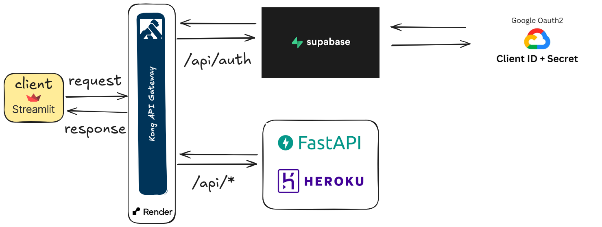

## Sơ đồ quản lý secret bằng doppler

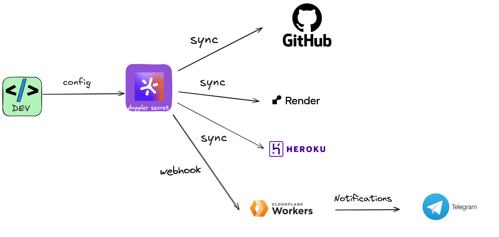

## Sơ đồ CICD bằng Github Action

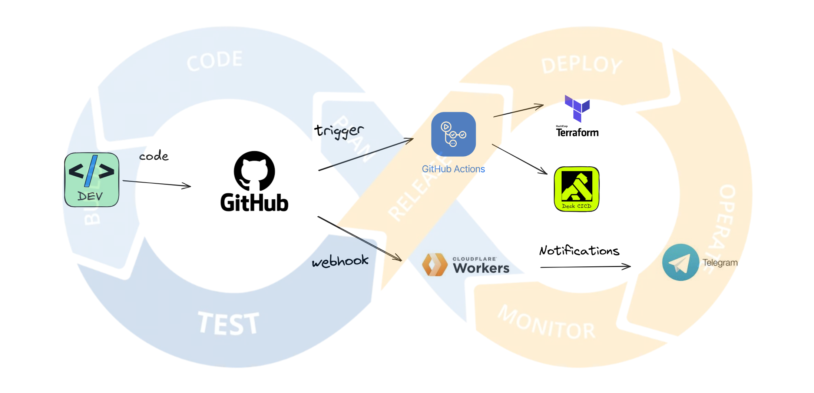

## Sơ đồ quản lý Kong API Gateway

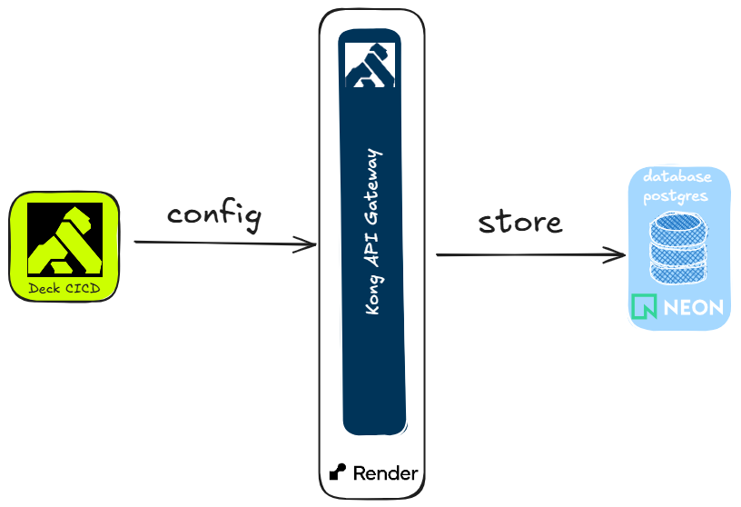

## Sơ đồ Infrastructure as Code (IaC) sử dụng terraform

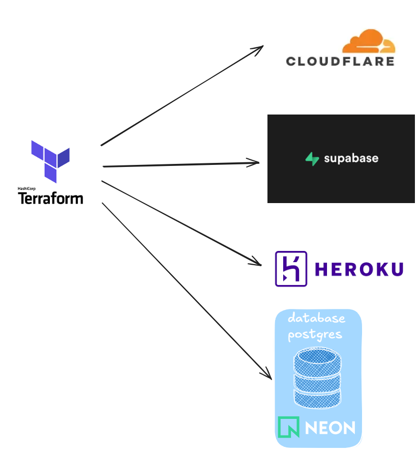

## Sơ đồ Data Pipeline

<!-- Data Source -->

<!-- crawl-data -->

<!-- Staging Area -->

<!-- ETL -->

<!-- Destination -->

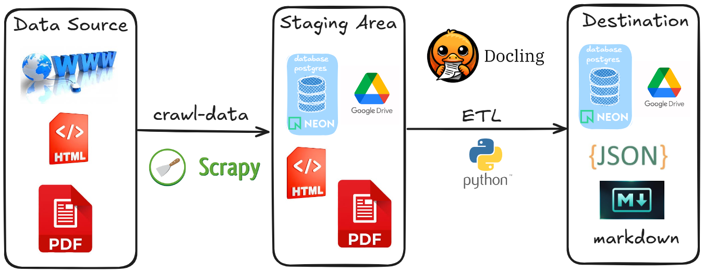

## Sơ đồ thu thập dữ liệu

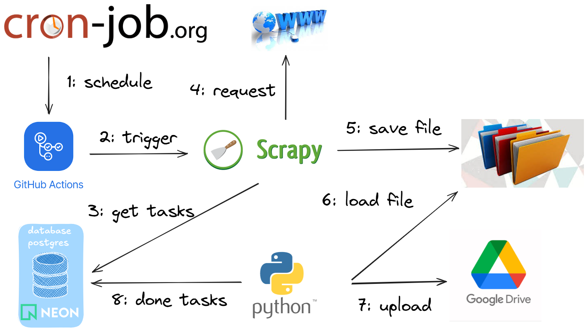

## Sơ đồ tiền xử lý dữ liệu ETL

- [ ] Trích xuất nội dung thẻ HTML

- [ ] Trích xuất nội dung tiêu đề số liệu bên trên

- [ ] Trích xuất nội dung người ký bên dưới

- [ ] Chuyển đổi ngày tháng năm

- [ ] Trích xuất nội dung quan trọng ở giữa

- [ ] Sử dụng docling để chuyển thành JSON, markdown

- [ ] Sử dụng langchain : Chunking và embeddings dữ liệu

- [ ] Có thể dùng chroma hoặc database postgres

## Sơ đồ RAG

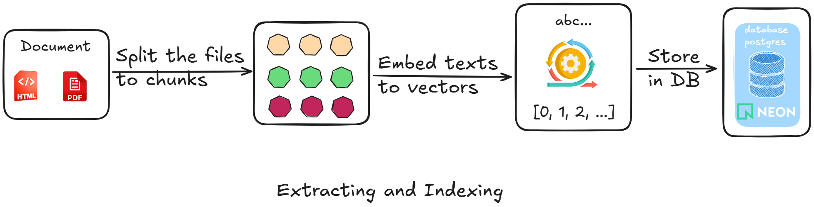

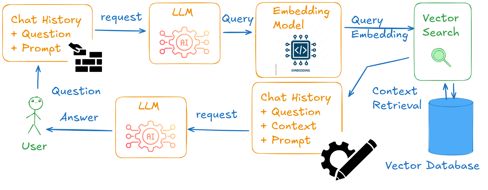

## Sơ đồ Tổng quan chung về backend AI

Backend và AI cùng chung 1 dự án, sau này có thể tách thành 1 backend hoặc microservices NestJS (dự kiến)

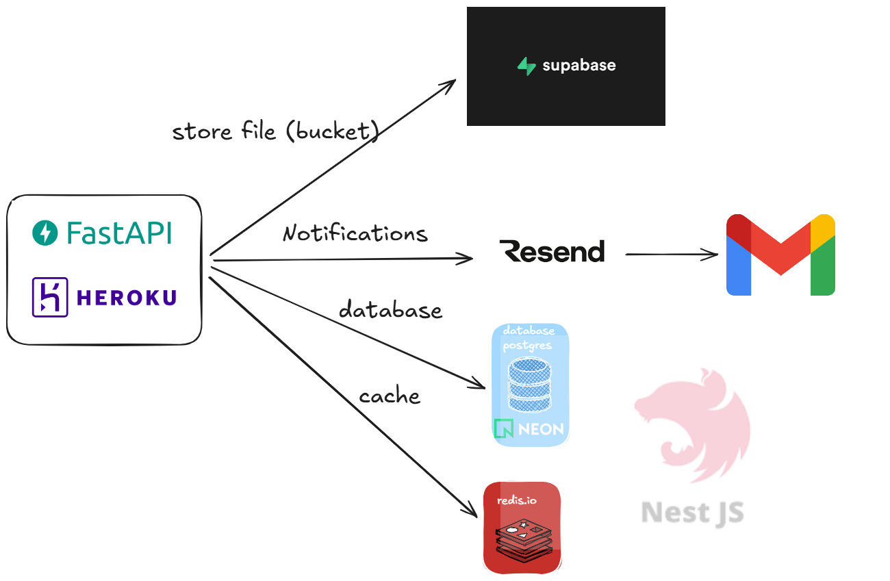

## Tích hợp LangChain

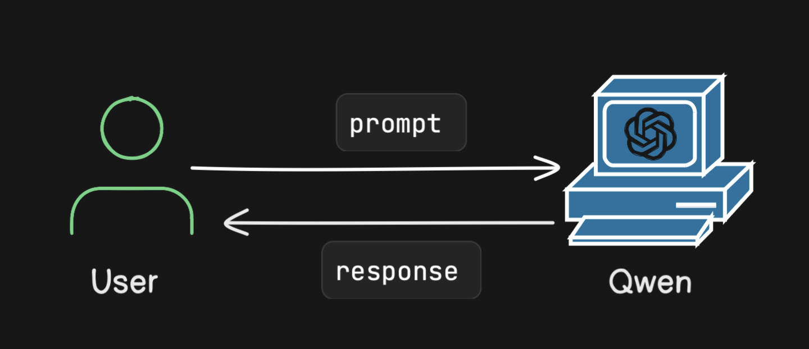

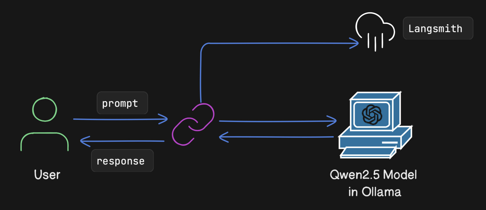
